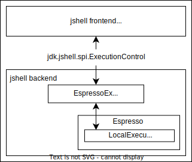

# Native JShell and Espresso: Mixing AOT and JIT for Java

This demo showcases the integration between [GraalVM Native Image](https://www.graalvm.org/reference-manual/native-image/) and [Espresso (Java on Truffle)](https://www.graalvm.org/latest/reference-manual/espresso/).  
It builds a native executable version of `jshell`, that executes the dynamically generated bytecode on Espresso. This hybrid mode achieves instant startup, beating the vanilla `jshell` in both: time to the first interaction and time to evaluate a simple expression.

JShell is a Java read-eval-print loop tool first introduced in Java 9, this demo also allows running `jshell` on Java 8.  
For further discussions and questions please join our `#espresso` channel on the [GraalVM Slack Community](https://graalvm.slack.com/).

## Prerequisites

- GraalVM for Java 11, 17 or higher
- Espresso (Java on Truffle) support

## Preparation

1. Download and install the GraalVM JDK with Native Image and Espresso support using the [GraalVM JDK Downloader](https://github.com/graalvm/graalvm-jdk-downloader).
    ```bash
    bash <(curl -sL https://get.graalvm.org/jdk) -c 'espresso'
    ```
    The download script will provide the `JAVA_HOME`, `PATH`, and `GRAALVM_HOME` environment variables (follow the command line prompt).

2. Download or clone GraalVM demos repository and navigate into the `espresso-jshell` directory:
    ```bash
    git clone https://github.com/graalvm/graalvm-demos
    ```
    ```bash
    cd graalvm-demos/archive/espresso-jshell
    ```

## Building Native `jshell`

1. Execute the `build-espresso-jshell.sh` script:
    ```bash
    ./build-espresso-jshell.sh
    ```
    It generates a native executable `espresso-jshell` in the working directory which starts instantaneously, and you can pass the options to (the same way as you would pass the options to `jshell`).

2. Launch `./espresso-jshell -Dorg.graalvm.home="$JAVA_HOME"`, execute some Java code and see the output immediately.
    Specifying a `JAVA_HOME` is the easiest way for Espresso and `jshell` to find all these dependencies e.g. `./espresso-jshell -Dorg.graalvm.home="$JAVA_HOME"`.  

3. To exit the shell, type `/exit`.

The native `espresso-jshell` is not fully standalone, it does not bundle _jars/jmods_ nor the core Java native libraries. `jshell` also needs a `java.home` for the host Java compiler. `espresso-jshell` does not require a full-blown GraalVM distribution to run. It can run with a minimal/jlink-ed `JAVA_HOME` that includes the Espresso home (`$JAVA_HOME/languages/java`), mimicking the same folder structure as GraalVM.

## Running `jshell` on Java 8

`jshell` was first introduced in Java 9, but thanks to Java's excellent backwards compatibility, it's possible to run `jshell` on a Java 8 environment.

```bash
export JAVA_HOME="/path/to/graalvm"
```
```bash
export JDK8_HOME="/path/to/jdk8"
```
```bash
./jshell8.sh [options...]
```

It may seem that `espresso-jshell` is running Java 11 in this mode, and it is.  
The frontend, `jshell`, is compiled by `native-image` with Java 11 (or 17), but the Java compiler (`javac` has a Java API used by `jshell`) is fully backwards compatible with Java 8, for example `javac -source 8 -target 8 -bootclasspath JAVA8_BOOT_CLASSPATH`.  
The generated bytecodes are then executed in Espresso (the backend) which runs a Java 8 guest JVM.

You can run the following snippet to convince yourself that it indeed, runs on Java 8:
```java
System.getProperty("java.vm.version");

// `jshell -C-source -C8` forbids getModule() access from code,
// but it is still accessible through reflection.
Object.class.getModule();

// In true Java 8 mode, getModule() is not accessible at all,
// not even through reflection.
Class.class.getDeclaredMethod("getModule");
```

Pass system properties to Espresso with `-R-Dkey=value`.  
Pass polyglot options to Espresso with `-Rjava.InlineFieldAccessors -Rengine.Compilation=false`.

## How it works?

For hybrid projects like this one, a clear boundary between host and guest code is a requirement.  
`jshell` has two main components: the frontend, which includes the console interface and the Java compiler; and the backend, referred as the "execution engine", where the dynamically generated bytecodes are executed.

`jshell` allows to implement custom backends (see [jdk.jshell.spi.ExecutionControl](https://docs.oracle.com/en/java/javase/11/docs/api/jdk.jshell/jdk/jshell/spi/ExecutionControl.html)). This is a very clean boundary since there are no complex objects crossing it, only primitives, strings, arrays and a few exceptions. It also provides a few implementations, for example, [JdiDefaultExecutionControl](https://docs.oracle.com/en/java/javase/11/docs/api/jdk.jshell/jdk/jshell/execution/JdiDefaultExecutionControl.html) which spawns another process and communicates with it through JDI, [LocalExecutionControl](https://docs.oracle.com/en/java/javase/11/docs/api/jdk.jshell/jdk/jshell/execution/LocalExecutionControl.html) which runs in the same VM as `jshell`.

To communicate between host and guest sides, an [adapter](https://github.com/mukel/graalvm-demos/blob/master/espresso-jshell/src/main/java/com/oracle/truffle/espresso/jshell/EspressoExecutionControl.java) was implemented in host Java that, via interop, forwards all methods calls to an Espresso guest object, taking care of converting all the arguments and return values, translating guest exceptions to host exceptions, and so on.  
On the Espresso side, a guest [LocalExecutionControl](https://docs.oracle.com/en/java/javase/11/docs/api/jdk.jshell/jdk/jshell/execution/LocalExecutionControl.html) executes all the methods calls forwarded by the host adapter; any other guest `ExecutionControl` implementation could be used.

<p align="center">
    
</p>

`espresso-jshell` runs partially on a guest `LocalExecutionControl` instance, so it behaves similar to `jshell -execution local` and shall not be compared with the default `jshell` execution mode, for example, class redefinition is not supported in this mode, `jshell -execution local` does not support it either. It does not support other execution engines other than `-execution espresso`, which is our host-to-guest adapter (see [EspressoLocalExecutionControlProvider](https://github.com/graalvm/graalvm-demos/blob/master/espresso-jshell/src/main/java/com/oracle/truffle/espresso/jshell/EspressoLocalExecutionControlProvider.java)).

Since the Java compiler is part of the host code compiled by `native-image`, dynamically loaded annotation processors are not supported. Annotation processors must be compiled AOT by `native-image`. But this limitation could be lifted: since the Java compiler provides an interface to implement annotation processors, it could be possible to run the Java compiler on the host and the dynamically loaded annotation processors on Espresso using the same idea we just described.

### Learn more

Learn more about mixing JIT and native modes in the [official Espresso documentation](https://www.graalvm.org/latest/reference-manual/espresso/demos/#mixing-aot-and-jit-for-java).