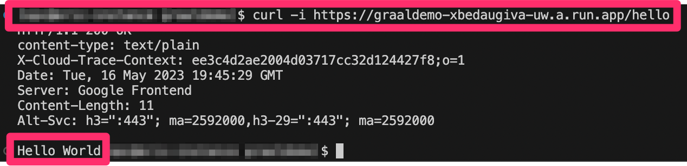
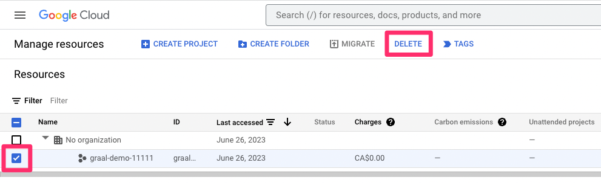

GraalVM on Google Cloud Run Demo
================================
This demo will walk you through the processes for deploying Native Image applications onto the Google Cloud Run platform. In this demo, you will deploy a simple "Hello World" HTTP application and have the ability to see details about its performance.

Prerequisites
----------------------
Ensure that you have the following installed and follow the linked instructions for any that you are missing:
- A Docker-API compatible container runtime such as [Rancher Desktop](https://docs.rancherdesktop.io/getting-started/installation/) or [Docker](https://www.docker.io/gettingstarted/)
    - Ensure that the daemon is actively running before beginning the demo
- Google Cloud CLI: https://cloud.google.com/sdk/docs/install#linux
- GraalVM: https://www.graalvm.org/downloads/

**COMPATIBILITY**: Please note that this demo must be performed on an x86-based platform in order to properly function. Working through this demo on an ARM-based platform will result in the generation of a native executable that is not compatible with the platform.

Download or clone the GraalVM demos repository:
```sh
git clone https://github.com/graalvm/graalvm-demos
```

Micronaut "Hello World" Application
----------------------
The code provided in this demo is a simple "Hello World" REST application created using the Micronaut &reg; framework. To understand what the code is doing, take a look at the _Application.java_ and _HelloController.java_ files:

**Application.java**

```java
package example.micronaut;

import io.micronaut.runtime.Micronaut;

public class Application {

    public static void main(String[] args) {
        Micronaut.run(Application.class, args);
    }
}
```

This is the location of the main() function and entry point for the application.

**HelloController.java**

```java
package example.micronaut;

import io.micronaut.http.MediaType;
import io.micronaut.http.annotation.Controller;
import io.micronaut.http.annotation.Get;
import io.micronaut.http.annotation.Produces;

@Controller("/hello") 
public class HelloController {
    @Get 
    @Produces(MediaType.TEXT_PLAIN) 
    public String index() {
        return "Hello World"; 
    }
}
```

This code implements the actual RESTful "Hello World" functionality. It produces the "Hello World" string when a GET request is made to the _/hello_ URL.

Deploying a Native Image Application
----------------------
1. Navigate to the directory for this demo:
```sh
cd graalvm-demos/native-google-cloud-run
```
2. Login to your Google account using the Google Cloud CLI:
```sh
gcloud auth login
```
3. Run the following command to configure Docker credentials for the CLI:
```sh
gcloud auth configure-docker
```
4. Create a new project using the following command, where "xxxxxx" denotes the 6-digit identifier you chose for your project:
```sh
gcloud projects create graal-demo-xxxxxx
```
5. Set your newly created project to be currently selected:
```sh
gcloud config set project graal-demo-xxxxxx
```
To see a list of all projects use:
```sh
gcloud projects list
```
6. Use a browser to login to the Google Cloud dashboard and navigate to the [Billing](https://console.cloud.google.com/billing/projects) tab
7. Ensure that you have a billing account set up and enable billing for the newly created project by clicking the ellipsis beside the project name and selecting **Change billing**


8. Return to your terminal and activate the required project APIs using the following command:
```sh
gcloud services enable run.googleapis.com container.googleapis.com
```
__OPTIONAL__: In the next step you will use a single command to build the application into a container image and deploy it to the repository you have created; if you would like to first view the Docker file that will be used to create the image, run the following command:
```sh
./mvnw mn:dockerfile -Dpackaging=docker-native
```
The newly created Dockerfile will be automatically stored in the _target_ directory

9. Push the application image to Google Cloud Container Registry (once again replacing "xxxxxx" as appropriate):
```sh
./mvnw deploy -Dpackaging=docker-native -Djib.to.image=gcr.io/graal-demo-xxxxxx/graaldemo:latest
```


10. Deploy the application to Google Cloud Run:
```sh
gcloud run deploy --image=gcr.io/graal-demo-xxxxxx/graaldemo:latest --platform managed --allow-unauthenticated
```


11. Once the application is successfully deployed, a Service URL will be outputted. Use that URL in the following command to test the application - a success will return the string "Hello World":
```sh
curl SERVICE_URL/hello
```



12. To view detailed information about the application performance such as build and response times, visit [Google Cloud Logging](https://console.cloud.google.com/logs/)

Clean-Up
-----------------------
Once you are finished with the demo, follow these steps to delete the created resources:
1. Use a browser to login to the Google Cloud dashboard and navigate to the [Resource Manager](https://console.cloud.google.com/cloud-resource-manager?previousPage=%2Fprojectselector2&organizationId=0)
2. Check the box next to the name of the project you wish to delete
3. Click **DELETE** on the top bar and follow the on-screen instructions

