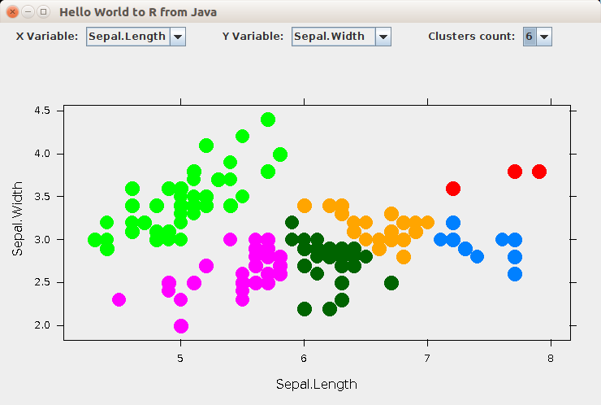

# R's graphical output in Java based desktop application

This demo shows an interactive Java based desktop application that displays k-means  clustering on the iris data set.
The user can choose variables for the x and y axes and the number of clusters.
The UI is updated accordingly in real time.
The clustering and plotting is done in R using `kmeans` function from the stats package and `xyplot` function from the lattice package.

Under the hood, FastR emulates the grid and grDevices packages purely in Java and is capable of drawing directly to Graphics2D context without the typical cost of crossing language boundaries.

## Setup

Follow the instructions from the top level [README](../README.md) to install and setup GraalVM
and then execute the `build.sh` script.

## Run

Execute the `run.sh` script.
