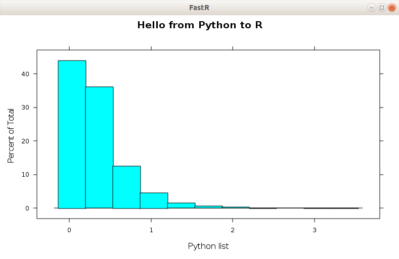
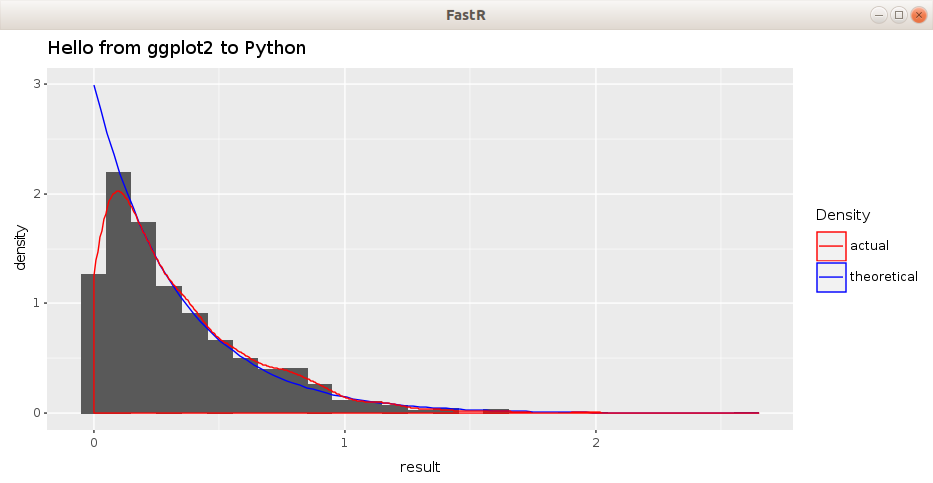

 

# Using R packages from within Python with GraalVM

This demo shows how to access functionality of R packages from within Python (ks.test and lattice) using the built-in language interoperability feature of GraalVM.

We generate random numbers drawn from the exponential distribution in Python. If we want to test that the sample we generated is really from the exponential distribution,
we can use the [Kolmogorov-Smirnov test](https://en.wikipedia.org/wiki/Kolmogorov%E2%80%93Smirnov_test), which is implemented in the base R library (function `ks.test`). 
Moreover, we can use the lattice R package or ggplot2 to visualize the Python data.

## Setup

Follow the instructions from the top level [README](../README.md) to install and setup GraalVM.
Moreover, to run the ggplot2 part of the example, install ggplot2 package using:

```
$GRAALVM_DIR/bin/R -e 'install.packages("ggplot2")'
```

## Run

The example can be executed using the `run.sh` script. However, 
in such case the visualizations are closed immediately once the script finishes. 
To keep the visualizations open, run GraalPython interactive shell:

```
$GRAALVM_DIR/bin/graalpython --polyglot --jvm
```

and copy & paste the code from the `exp.py` script file.

