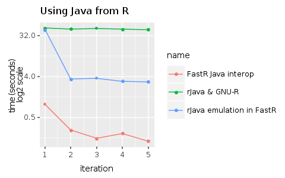

# rJava package and built-in Java interoperability in FastR

This benchmark demonstrates the difference between the performance of rJava on GNU-R, rJava on FastR and builtin Java interoperability in FastR.

Note FastR provides custom patched version of rJava where the C
code that handles the communication with JVM is replaced by R code
that uses the builtin Java interoperability to achieve the same.

## Setup

Follow the instructions from the top level [README](../README.md) to install and setup GraalVM.
Install the patched version of rJava using:

```
git clone https://github.com/oracle/fastr.git /tmp/fastr-repo
$GRAALVM_DIR/bin/R CMD INSTALL /tmp/fastr-repo/com.oracle.truffle.r.pkgs/rJava
```

Note: the example invokes Java compiler using `system2` builtin. 
For this to work you need to export variable `JAVA_HOME` pointing to Java installation. 
This is done automatically on GraalVM, but not if run these examples on GNU-R.

## Run

Execute either `r_java_bench.R` or `fastr_java_bench.R` using `Rscript`, for example:

```
$GRAALVM_DIR/bin/Rscript --jvm r_java_bench.R
```
