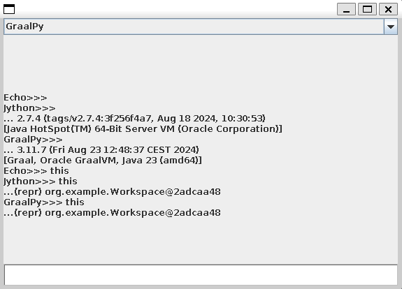

# Migrating from Jython to GraalPy for Java Integrations

Jython can be embedded into Java applications to, for example, provide scripting capabilities to Java applications or to extend applications with Python modules.
"Scripting for the Java Platform", also known as JSR 223, provides a generic mechanism for such integrations.
This mechanism has some limitations, but is supported by both Jython and [Truffle](https://www.graalvm.org/latest/reference-manual/embed-languages/#compatibility-with-jsr-223-scriptengine).
However, Jython also provides an API to interact with the Python interpreter directly and migrating such integrations to GraalPy requires more work to match the appropriate APIs.

## 1. Getting Started

In this guide, we will show how to migrate from Jython to GraalPy on a Java application that uses Swing for interactive scripting.


## 2. What you will need

To complete this guide, you will need the following:

 * Some time on your hands
 * A decent text editor or IDE
 * A supported JDK[^1], preferably the latest [GraalVM JDK](https://graalvm.org/downloads/)

 [^1]: Oracle JDK 17 and OpenJDK 17 are supported with interpreter only.
 GraalVM JDK 21, Oracle JDK 21, OpenJDK 21 and newer with [JIT compilation](https://www.graalvm.org/latest/reference-manual/embed-languages/#runtime-optimization-support).
 Note: GraalVM for JDK 17 is **not supported**.

## 3. The original application

The demo application we use provides a Swing UI with text input, a label, and a drop-down menu.
Each element of the drop-down menu defines how to interpret text inputs, as well as setup and teardown code for the interpreter.
The simplest interpreter is "Echo", which needs no setup or teardown and simply returns the input string back:

`EchoInputCallback.java`
```java
package org.example;

final class EchoInputCallback implements InputCallback {
    @Override
    public void setUp(Workspace workspace) {
    }

    @Override
    public String interpret(String code) {
        return code;
    }

    @Override
    public void tearDown() {
    }
}
```

The Jython entry uses Jython to evaluate the code and return the result.

`JythonInputCallback.java`
```java
package org.example;

import org.python.core.*;
import org.python.util.PythonInterpreter;

final class JythonInputCallback implements InputCallback {
    static PyCode JYTHON_CODE = new PythonInterpreter().compile("__import__('sys').version"); // ①
    private PythonInterpreter python;

    @Override
    public void setUp(Workspace workspace) {
        var globals = new PyDictionary();
        this.python = new PythonInterpreter(globals); // ②
        globals.put(new PyString("this"), workspace);
    }

    @Override
    public String interpret(String code) {
        try {
            PyObject result;
            if (code.isBlank()) {
                result = python.eval(JYTHON_CODE);
            } else {
                result = python.eval(code);
            }
            if (result instanceof PyString strResult) {  // ③
                return code + "\n... " + strResult.asString();
            }
            return code + "\n...(repr) " + result.__repr__();
        } catch (PySyntaxError e) {
            python.exec(code); // ④
            return "";
        }
    }

    @Override
    public void tearDown() {
        python.close();
    }
}
```

❶ Jython compiles Python code snippets to PyCode objects, which hold bytecode and can be stored and re-used, serialized, and run in different Jython executions without re-parsing.

❷ The PythonInterpreter class is the official API to instantiate Jython. A custom `PyDictionary` object can be passed that can be used to share global bindings with Java.

❸ Jython returns evaluation results directly as the implementation types of the Python runtime.

❹ The Jython interpreter exposes the Python-specific difference between `eval` of expressions and `exec` of statements by raising a syntax error.

## 4. Migrating the application

We recommend to check out the [completed example](./) and follow along with the steps in the next sections that were used to migrate the application step by step.

## 4.1 Dependency configuration

Add the required dependencies for GraalPy in the `<dependencies>` section of the POM.

`pom.xml`
```xml
  <dependency>
    <groupId>org.graalvm.polyglot</groupId>
    <artifactId>python</artifactId> <!-- ① -->
    <version>24.1.0</version>
    <type>pom</type> <!-- ② -->
  </dependency>

  <dependency>
    <groupId>org.graalvm.polyglot</groupId>
    <artifactId>polyglot</artifactId> <!-- ③ -->
      <version>24.1.0</version>
  </dependency>
```

❶ The `python` dependency is a meta-package that transitively depends on all resources and libraries to run GraalPy.

❷ Note that the `python` package is not a JAR - it is simply a `pom` that declares more dependencies.

❸ The `polyglot` dependency provides the APIs to manage and use GraalPy and other Graal languages from Java.

## 4.2 Migrating the setup code

`GraalPyInputCallback.java`
```java
package org.example;

import org.graalvm.polyglot.*;

final class GraalPyInputCallback implements InputCallback {
    static Source GRAALPY_CODE = Source.create("python", "__import__('sys').version");
    static Engine engine = Engine.create("python");
    private Context python;
    
    @Override
    public void setUp(Workspace workspace) {
        this.python = Context.newBuilder("python") // ①
            .engine(engine) // ②
            .allowAllAccess(true).option("python.EmulateJython", "true") // ③
            .build();
        python.getBindings("python").putMember("this", workspace); // ④
    }
```

❶ The [Polyglot API](https://www.graalvm.org/sdk/javadoc/org/graalvm/polyglot/Context.html) is the generic way to create interpreters of Graal languages, including GraalPy.

❷ Where Jython allows sharing code by sharing `PyCode` objects, Graal languages share code by holding on to [`Source`](https://www.graalvm.org/sdk/javadoc/org/graalvm/polyglot/Source.html) objects.
JIT compiled code related to a given `Source` is shared when running on a Graal JDK if multiple Contexts are configured to share an [`Engine`](https://www.graalvm.org/sdk/javadoc/org/graalvm/polyglot/Engine.html).

❸ Jython does not impose access restrictions on the Python code.
GraalPy, on the other hand, is locked down by default.
Jython also provides some conveniences such as redirecting Python field access to Java object getter methods.
For migration it makes sense to remove access restrictions and enable additional Jython heuristics also on GraalPy.
After migration, we should try to remove as many permissions and heuristics as possible.

❹ Instead of accessing the Python `globals` dictionary, which is a detail of the Python language, [bindings](https://www.graalvm.org/sdk/javadoc/org/graalvm/polyglot/Context.html#getBindings(java.lang.String)) offer a language-agnostic way to interact with the global scope.

## 4.3 Migrating the interpretation

`GraalPyInputCallback.java`
```java
@Override
public String interpret(String code) {
    Value result;
    if (code.isBlank()) {
        result = python.eval(GRAALPY_CODE);
    } else {
        result = python.eval("python", code); // ①
    }
    if (result.isString()) { // ②
        return code + "\n... " + result.asString();
    }
    return code + "\n...(repr) " + result.toString();
}
```

❶ Evaluation of code is very similar to how it is done for Jython.
Note, however, that the distinction in the Python language between `exec` and `eval` is not exposed, so both are represented with the same API call on GraalPy.

❷ GraalPy implementation types are hidden behind the [`Value`](https://www.graalvm.org/sdk/javadoc/org/graalvm/polyglot/Value.html) type, so instead of Java typechecks there are APIs to determine what kind of object we are dealing with and to convert it to basic Java types like `String`.

## 4.4 Migrating the teardown

`GraalPyInputCallback.java`
```java
@Override
public void tearDown() {
    python.close(true); // ①
}
```

❶ Closing the Jython interpreter cancels all executions that may be running on other threads, whereas GraalPy tries to wait for executions to finish.
To get the same behavior as Jython, we pass `true` to the `close` call to cancel executions immediately.

## 5. Running the application

If you downloaded the [example](https://github.com/graalvm/graalpy-demos/tree/master/jython), you can now compile and run your application from the commandline:

```shell
./mvnw compile
./mvnw exec:java -Dexec.mainClass=org.example.App
```

You can switch between Jython and GraalPy and compare the output.
Also try to access the `this` object that is injected into the top Python scope.
Try to access the `this.frame` and you will observe that the `getFrame()` method is selected to get the result heuristically.

## 6. Next steps

- Use GraalPy in a [clean-slate Java SE application](../graalpy-javase-guide/README.md)
- Use GraalPy with popular Java frameworks, such as [Spring Boot](../graalpy-spring-boot-guide/README.md) or [Micronaut](../graalpy-micronaut-guide/README.md)
- Install and use Python packages that rely on [native code](../graalpy-native-extensions-guide/README.md), e.g. for data science and machine learning
- Follow along how you can manually [install Python packages and files](../graalpy-custom-venv-guide/README.md) if the Maven plugin gives not enough control
- [Freeze](../graalpy-freeze-dependencies-guide/README.md) transitive Python dependencies for reproducible builds


- Learn more about the GraalPy [Maven plugin](https://www.graalvm.org/latest/reference-manual/python/Embedding-Build-Tools/)
- Learn more about the Polyglot API for [embedding languages](https://www.graalvm.org/latest/reference-manual/embed-languages/)
- Explore in depth with GraalPy [reference manual](https://www.graalvm.org/latest/reference-manual/python/)
