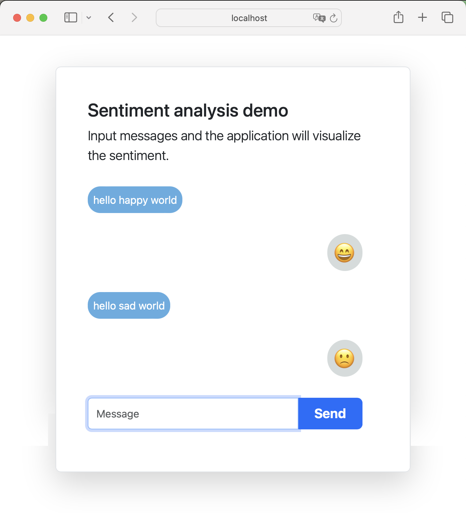

## GraalPy Spring Boot Guide

## 1. Getting Started

In this guide, we will use the Python library [vaderSentiment](https://github.com/cjhutto/vaderSentiment) from a Spring Boot application written in Java.


## 2. What you will need

To complete this guide, you will need the following:

* Some time on your hands
* A decent text editor or IDE
* A supported JDK[^1], preferably the latest [GraalVM JDK](https://graalvm.org/downloads/)

  [^1]: Oracle JDK 17 and OpenJDK 17 are supported with interpreter only.
  GraalVM JDK 21, Oracle JDK 21, OpenJDK 21 and newer with [JIT compilation](https://www.graalvm.org/latest/reference-manual/embed-languages/#runtime-optimization-support).
  Note: GraalVM for JDK 17 is **not supported**.

## 3. Solution

We recommend that you follow the instructions in the next sections and create the application step by step.
However, you can go right to the [completed example](./).

## 4. Writing the application

You can use [Spring Initializr](https://start.spring.io/) project generator to generate a basic Spring Boot project skeleton. To generate a project:

1. Navigate to https://start.spring.io/
2. GraalPy currently provides a plugin for *Maven*, but not yet for *Gradle*. Select **Maven** as the build system.
3. Click on **Dependencies** and select **Spring Web**
4. Click on **Dependencies** and select **Thymeleaf**
5. Click on **Generate**. Download and extract the generated ZIP file

### 4.1. Application

The generated Spring Boot application will contain the file  _DemoApplication.java_, which is used when running the application via Maven or via deployment.
You can also run the main class directly within your IDE if it is configured correctly.

`src/main/java/com/example/demo/DemoApplication.java`
```java
package com.example.demo;

import org.springframework.boot.SpringApplication;
import org.springframework.boot.autoconfigure.SpringBootApplication;

@SpringBootApplication
public class DemoApplication {
    public static void main(String[] args) {
        SpringApplication.run(DemoApplication.class, args);
    }
}
```

### 4.2 Dependency configuration

Add the required dependencies for GraalPy in the dependency section of the POM.

`pom.xml`
```xml
<dependency>
  <groupId>org.graalvm.python</groupId>
  <artifactId>python</artifactId> <!-- ① -->
  <version>24.1.0</version>
  <type>pom</type> <!-- ② -->
</dependency>
<dependency>
  <groupId>org.graalvm.python</groupId>
  <artifactId>python-embedding</artifactId> <!-- ③ -->
  <version>24.1.0</version>
</dependency>
```

❶ The `python` dependency is a meta-package that transitively depends on all resources and libraries to run GraalPy.

❷ Note that the `python` package is not a JAR - it is simply a `pom` that declares more dependencies.

❸ The `python-embedding` dependency provides the APIs to manage and use GraalPy from Java.

### 4.3 Adding packages - graalpy-maven-plugin configuration

Most Python packages are hosted on [PyPI](https://pypi.org) and can be installed via the `pip` tool.
The Python ecosystem has conventions about the filesystem layout of installed packages that need to be kept in mind when embedding into Java.
You can use the GraalPy Maven plugin to manage Python packages for you.

Also add the `graalpy-maven-plugin` configuration into the plugins section of the POM.

`pom.xml`
```xml
<plugin>
    <groupId>org.graalvm.python</groupId>
    <artifactId>graalpy-maven-plugin</artifactId>
    <version>24.1.0</version>
    <executions>
        <execution>
            <configuration>
                <packages> <!-- ① -->
                    <package>vader-sentiment==3.2.1.1</package> <!-- ② -->
                    <package>requests</package> <!-- ③ -->
                </packages>
            </configuration>
            <goals>
                <goal>process-graalpy-resources</goal>
            </goals>
        </execution>
    </executions>
</plugin>
```

❶ The `packages` section lists all Python packages optionally with [requirement specifiers](https://pip.pypa.io/en/stable/reference/requirement-specifiers/).

❷ Python packages and their versions can be specified as if used with pip.
Install and pin the `vader-sentiment` package to version `3.2.1.1`.

❸ The `vader_sentiment` package does not declare `requests` as a dependency so it has to done so manually at this place.

### 4.4 Creating a Python context

GraalPy provides APIs to make setting up a context to load Python packages from Java as easy as possible.

Create a Java class which will serve as a wrapper bean for the GraalPy context:

`src/main/java/com/example/demo/GraalPyContext.java`
```java
package com.example.demo;

import jakarta.annotation.PreDestroy;
import org.graalvm.polyglot.Context;
import org.graalvm.polyglot.Value;
import org.graalvm.python.embedding.utils.GraalPyResources;
import org.springframework.stereotype.Component;

@Component // ①
public class GraalPyContext {
    static final String PYTHON = "python";

    private final Context context;

    public GraalPyContext() {
        context = GraalPyResources.contextBuilder().build(); // ②
        context.initialize(PYTHON); // ③
    }

    public Value eval(String source) {
        return context.eval(PYTHON, source); // ④
    }

    @PreDestroy
    public void close() {
        context.close(true); // ⑤
    }
}
```

❶ Eagerly initialize as a singleton component.

❷ The created GraalPy context will serve as a single access point to GraalPy for the whole application.

❸ Initializing a GraalPy context isn't cheap, so we do so already at creation time to avoid delayed response time.

❹ Evaluate Python code in the GraalPy context.

❺ Close the GraalPy context at application shutdown.

### 4.5 Using a Python library from Java

After reading the [vaderSentiment](https://github.com/cjhutto/vaderSentiment) docs, you can now write the Java interface that matches the Python type and function you want to call.

GraalPy makes it easy to access Python objects via these interfaces.
Java method names are mapped directly to Python method names.
Return values and arguments are mapped according to a set of [generic rules](https://www.graalvm.org/latest/reference-manual/python/Modern-Python-on-JVM/#java-to-python-types-automatic-conversion) as well as the [Target type mapping](https://www.graalvm.org/truffle/javadoc/org/graalvm/polyglot/Value.html#target-type-mapping-heading).
The names of the interfaces can be chosen freely, but it makes sense to base them on the Python types, as we do below.

Your application will call the Python function `polarity_scores(text)` from the `vader_sentiment.SentimentIntensityAnalyzer` Python class.

In oder to do so, create a Java interface with a method matching that function:

`src/main/java/com/example/demo/SentimentIntensityAnalyzer.java`
```java
package com.example.demo;

import java.util.Map;

public interface SentimentIntensityAnalyzer {
    Map<String, Double> polarity_scores(String text); // ①
}
```

❶ The Java method to call into `SentimentIntensityAnalyzer.polarity_scores(text)`.
The Python return value is a `dict` and can be directly converted to a Java Map on the fly.
The same applies to the argument, which is a Python String and therefore also a String on Java side.

Using this Java interface and the GraalPy context, you can now construct a bean which calls the `SentimentIntensityAnalyzer.polarity_scores(text)` Python function:

`src/main/java/com/example/demo/SentimentAnalysisService.java`
```java
package com.example.demo;

import org.springframework.stereotype.Service;

import java.util.Map;

@Service
public class SentimentAnalysisService {
    private final SentimentIntensityAnalyzer sentimentIntensityAnalyzer;

    public SentimentAnalysisService(GraalPyContext context) {
        var value = context.eval("""
                from vader_sentiment.vader_sentiment import SentimentIntensityAnalyzer
                SentimentIntensityAnalyzer() # ①
                """);
        sentimentIntensityAnalyzer = value.as(SentimentIntensityAnalyzer.class); // ②
    }

    public Map<String, Double> getSentimentScore(String text) {
        return sentimentIntensityAnalyzer.polarity_scores(text); // ③
    }
}
```

❶ The executed Python snippet imports the `vader_sentiment.SentimentIntensityAnalyzer` Python class into the GraalPy context and returns a new instance of it.
Note that the GraalPy context preserves its state and an eventual subsequent `eval` call accessing `SentimentIntensityAnalyzer` would not require an import anymore.

❷ Map the obtained `org.graalvm.polyglot.Value` to the `SentimentIntensityAnalyzer` type.

❸ Return the `sentimentIntensityAnalyzer` object.

### 4.6 Index page

The application will have a simple chat-like view, which takes text as input and return its sentiment value in form of an emoticon.

Create a html file, which uses *jQuery* to query an API endpoint for the sentiment value.

`src/main/resources/templates/index.html`
```html
<!DOCTYPE html>
<html lang="en">
<head>
    <title>Demo App</title>
    <link href="https://cdn.jsdelivr.net/npm/bootstrap@5.3.3/dist/css/bootstrap.min.css" rel="stylesheet"
          integrity="sha384-QWTKZyjpPEjISv5WaRU9OFeRpok6YctnYmDr5pNlyT2bRjXh0JMhjY6hW+ALEwIH" crossorigin="anonymous">
    <script src="https://cdn.jsdelivr.net/npm/bootstrap@5.3.3/dist/js/bootstrap.bundle.min.js"
            integrity="sha384-YvpcrYf0tY3lHB60NNkmXc5s9fDVZLESaAA55NDzOxhy9GkcIdslK1eN7N6jIeHz"
            crossorigin="anonymous"></script>
    <script src="https://code.jquery.com/jquery-3.7.1.min.js"></script>
    <script language="JavaScript">
        $(document).ready(() => {
            $("#form").on("submit", (event) => {
                event.preventDefault();
                let messageInput = $("#message");
                let text = messageInput.val();
                messageInput.val("");
                $("#responses").append(`<div class="row py-3"><div class="col-12"><div class="message-query">${text}</div></div></div>`);
                $.getJSON(
                    "/analyze",
                    {text: text},
                    data => {
                        let reactions = [
                            [0.5, "\u{1F604}"],
                            [0.05, "\u{1F642}"],
                            [-0.05, "\u{1F610}"],
                            [-0.5, "\u{1F641}"],
                        ];
                        let selectedReaction = "\u{1F620}";
                        for (let [threshold, reaction] of reactions) {
                            if (data["compound"] > threshold) {
                                selectedReaction = reaction;
                                break;
                            }
                        }
                        $("#responses").append(`<div class="row py-3"><div class="col-12"><div class="message-reaction display-6">${selectedReaction}</div></div></div>`);
                    }
                );
            });
        });
    </script>
    <style>
        @media (min-width: 768px) {
            .main-container {
                width: 600px;
            }
        }

        .message-query, .message-reaction {
            width: fit-content;
            padding: 2%;
            border-radius: 1.2em;
            color: white;
        }

        .message-query {
            background-color: #5dade2;
        }

        .message-reaction {
            margin-left: auto;
            background-color: #d5dbdb;
        }
    </style>
</head>
<body>
<div class="container py-5 main-container">
    <div class="row align-items-center rounded-3 border shadow-lg">
        <div class="row p-5">
            <h2>Sentiment analysis demo</h2>
            <p class="lead">Input messages and the application will visualize the sentiment.</p>
            <div id="responses"></div>
            <form id="form">
                <div class="row py-3">
                    <div class="col-12">
                        <div class="input-group">
                            <input type="text" id="message" class="form-control" placeholder="Message" required>
                            <button type="submit" class="btn btn-primary btn-lg px-4 me-md-2 fw-bold">Send</button>
                        </div>
                    </div>
                </div>
            </form>
        </div>
    </div>
</div>
</body>
</html>
```

### 4.7 Controller

To create a microservice that provides a simple sentiment analysis, you also need a controller:

`src/main/java/com/example/demo/DemoController.java`
```java
package com.example.demo;

import org.springframework.stereotype.Controller;
import org.springframework.web.bind.annotation.*;

import java.util.Map;

@Controller
public class DemoController {
    private final SentimentAnalysisService sentimentAnalysisService; // ①

    public DemoController(SentimentAnalysisService sentimentAnalysisService) {
        this.sentimentAnalysisService = sentimentAnalysisService;
    }

    @GetMapping("/")
    public String answer() { // ②
        return "index";
    }

    @GetMapping(value = "/analyze", produces = "application/json")
    @ResponseBody
    public Map<String, Double> answer(@RequestParam String text) { // ③
        return sentimentAnalysisService.getSentimentScore(text); // ④
    }
}
```

❶ Inject our service commponent

❷ Serve the main page

❸ Serve the sentiment analysis endpoint

❹ Use the `SentimentAnalysisService` component to call the `SentimentIntensityAnalyzer.polarity_scores(text)` Python function.

### 4.8 Test

Create a test to verify that when you make a GET request to `/analyze` you get the expected sentiment score response:

`src/test/java/com/example/demo/DemoApplicationTests.java`
```java
package com.example.demo;

import org.junit.jupiter.api.Test;
import org.springframework.beans.factory.annotation.Autowired;
import org.springframework.boot.test.autoconfigure.web.servlet.AutoConfigureMockMvc;
import org.springframework.boot.test.context.SpringBootTest;
import org.springframework.test.annotation.DirtiesContext;
import org.springframework.test.web.servlet.MockMvc;

import static org.hamcrest.Matchers.greaterThan;
import static org.hamcrest.Matchers.lessThan;
import static org.springframework.test.web.servlet.request.MockMvcRequestBuilders.get;
import static org.springframework.test.web.servlet.result.MockMvcResultMatchers.jsonPath;
import static org.springframework.test.web.servlet.result.MockMvcResultMatchers.status;

@SpringBootTest
@AutoConfigureMockMvc
@DirtiesContext // Necessary to shut down GraalPy context
class DemoApplicationTests {

    @Autowired
    private MockMvc mockMvc; // ①

    @Test
    void testIndex() throws Exception { // ②
        mockMvc.perform(get("/")).andExpect(status().isOk());
    }

    @Test
    void testSentimentAnalysis() throws Exception { // ③
        mockMvc.perform(get("/analyze").param("text", "I'm happy"))
                .andExpect(status().isOk())
                .andExpect(jsonPath("$.compound", greaterThan(0.1)));
        mockMvc.perform(get("/analyze").param("text", "This sucks"))
                .andExpect(status().isOk())
                .andExpect(jsonPath("$.compound", lessThan(-0.1)));
    }
}
```

❶ Use Spring MVC Test framework to make requests to the controller.

❷ Use MVC mock to make request to the index page and verify it returned an Ok response.

❸ Use MVC mock to make requests to the `/analyze` endpoint and verify the compound sentiment values are within expected ranges.

## 5. Testing the Application

To run the tests:

```bash
./mvnw test
```

## 6. Running the Application

To run the application:

```bash
./mvnw spring-boot:run
```

This will start the application on port 8080.

## 7. GraalVM Native Executable

### 7.1. Native Executable metadata

The [GraalVM](https://www.graalvm.org/) Native Image compilation requires metadata to properly run code that uses [dynamic proxies](https://www.graalvm.org/latest/reference-manual/native-image/metadata/#dynamic-proxy).

For the case that also a native executable has to be generated, create a proxy configuration file:

`src/main/resources/META-INF/native-image/proxy-config.json`
```json
[
  ["com.example.demo.SentimentIntensityAnalyzer"]
]
```

### 7.2. Generate a Native Executable with GraalVM

We will use GraalVM, the polyglot embeddable virtual machine, to generate a native executable of our Spring Boot application.

Compiling native executables ahead of time with GraalVM improves startup time and reduces the memory footprint of JVM-based applications.

Make sure that the `JAVA_HOME` environmental variable is set to the location of a GraalVM installation.
We recommend using a GraalVM 24.1.

To generate a native executable using Maven, run:

```bash
./mvnw -Pnative native:compile
```

The native executable is created in the `target` directory and can be run with:

```bash
./target/demo
```

## 8. Next steps

- Use GraalPy in a [Java SE application](../graalpy-javase-guide/README.md)
- Use GraalPy with [Micronaut](../graalpy-micronaut-guide/README.md)
- Install and use Python packages that rely on [native code](../graalpy-native-extensions-guide/README.md), e.g. for data science and machine learning
- Follow along how you can manually [install Python packages and files](../graalpy-custom-venv-guide/README.md) if the Maven plugin gives not enough control
- [Freeze](../graalpy-freeze-dependencies-guide/README.md) transitive Python dependencies for reproducible builds
- [Migrate from Jython](../graalpy-jython-guide/README.md) to GraalPy


- Learn more about the GraalPy [Maven plugin](https://www.graalvm.org/latest/reference-manual/python/Embedding-Build-Tools/)
- Learn more about the Polyglot API for [embedding languages](https://www.graalvm.org/latest/reference-manual/embed-languages/)
- Explore in depth with GraalPy [reference manual](https://www.graalvm.org/latest/reference-manual/python/)