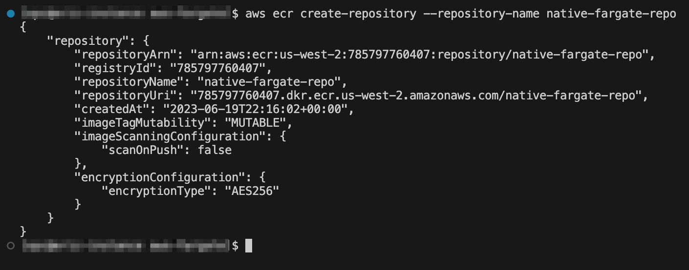

GraalVM on AWS Fargate Demo
=============================
This demo will walk you through the process of containerizing a Native Image application and then launching the image on the AWS platform by using the Amazon Elastic Container Registry and AWS Fargate. In this demo, you will deploy a simple "Hello World" HTTP application and have the ability to see details about its performance.

Prerequisites
----------------------
Ensure that you have the following installed and follow the linked instructions for any that you are missing:
- Docker: https://docs.docker.com/desktop/
- Amazon Web Service CLI: https://docs.aws.amazon.com/cli/latest/userguide/cli-chap-getting-started.html
    - Once installed, configure your AWS credentials: https://docs.aws.amazon.com/cli/latest/userguide/cli-authentication-user.html#cli-authentication-user-configure-wizard
- Amazon Elastic Container Service: https://docs.aws.amazon.com/AmazonECR/latest/userguide/get-set-up-for-amazon-ecr.html
- Apache Maven: https://maven.apache.org/install.html
- GraalVM: https://www.graalvm.org/downloads/

**COMPATIBILITY**: Please note that this demo must be performed on an x86-based system in order to properly function. Working through this demo on an ARM-based system will result in the generation of a native image executable that is not compatible with the platform.

Download or clone GraalVM demos repository:
```sh
git clone https://github.com/graalvm/graalvm-demos
```
    
Micronaut "Hello World" Application
----------------------
The code provided in this demo is a simple "Hello World" REST application created using the Micronaut framework. To understand what the code is doing, take a look at the _Application.java_ and _HelloController.java_ files:

**Application.java**


This is the location of the main() function and entry point for the application.

**HelloController.java**


This code implements the actual RESTful "Hello World" functionality. It produces the "Hello World" string when a GET request is made to the "/hello" URL.

Deploy a Native Image Container on Amazon ECR
----------------------
1. Navigate to the directory for this demo:
```sh
cd graalvm-demos/aws-fargate
```
2. Create a new ECR repository to store the image:
```sh
aws ecr create-repository --repository-name native-fargate-repo
```


3. A successful repository creation will return an output similar to above; note the "repositoryUri" that is outputted as this will be the location you will use to store your image
4. Authenticate the Uri for the repository with your credentials:
```sh
docker login -u AWS -p $(aws ecr get-login-password) REPOSITORYURI
```
__OPTIONAL__: In the next step you will use a single command to build the application into a container image and deploy it to the repository you have created; if you would like to first view the Docker file that will be used to create the image, run the following command:
```sh
./mvnw mn:dockerfile -Dpackaging=docker-native
```
The newly created Dockerfile will be automatically stored in the "target" directory

5. Use the Uri once again to push the image to the Amazon ECR:
```sh
./mvnw deploy -Dpackaging=docker-native -Djib.to.image=REPOSITORYURI
```

Deploy the Service on AWS Fargate
-------------------------
1. Login to the [Amazon Web Service dashboard](http://console.aws.amazon.com/)
2. In the “Services” drop-down menu on the top-left of the page, select “All services” and navigate to the “Elastic Container Service” page
3. Click on "Clusters" on the left-side pane
4. Create a new cluster using the button on the top-right of the page


5. Choose a name for the cluster and leave the remaining settings as their default
    - If you would like to be able to view insights about the container image perforamance, activate Container Insights under "Monitoring"

     

6. Once you have created the new cluster, navigate to "Task definitions" by selecting it on the left-side pane
7. Create a new task definition by clicking the button on the top-right corner


8. Choose names for the Task Definition Family and Container
9. Paste the REPOSITORYURI used in the prior section into the "Image URI" text box
    - To find the URI again click the "Amazon ECR" link on the left-side pane and select "Repositories". Your repository will appear along with the corresponding URI
10. Leave the remaining options as their default and create the new Task Definition
11. Return to the list of Clusters and select the Cluster that you created
12. Under "Tasks" click the "Run new task" button


13. Choose "Task" as the Application Type
14. Choose the newly created Task Definition under the "Family" drop-down menu and choose a name for the service


15. Under "Networking" -> "Security Group" select "Create a new security group"
16. Choose a name and description for the new group
17. For "Type" select "All traffic" and for "Source" select "Anywhere"


18. Click "Create" to create and deploy the task
19. Select the task currently running and copy the public IP address displayed on the right side of the page


20. In a new browser tab, type the IP address in the format: http://PUBLICIP:8080/hello
21. You should see a "Hello World" message displayed!


Clean-Up
-----------------
To prevent incurring additional charges after you are finished with the demo you first need to stop the service that you created. To do so, follow these instructions:
1. Visit the Task Definitions page and select the task currently running
2. Under Actions select "Deregister"
3. Change the drop-down view menu to show "Inactive task definitions"
4. Select the task definition and under Actions select "Delete"


6. Return to the cluster that you created and delete the task currently running
7. Use the button on the top-right of the screen to delete the cluster itself

