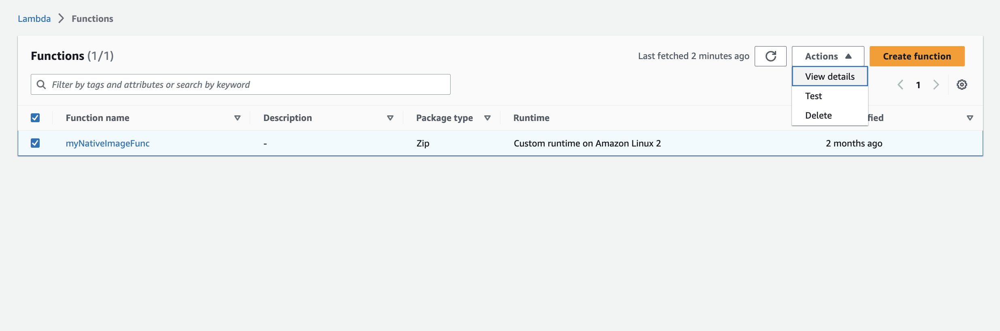

GraalVM on AWS Lambda Demo
====================
This demo will walk you through the processes for deploying both Java 17 and Native Image applications onto the AWS Lambda platform. In this demo, you will deploy a simple "Hello World" HTTP application and have the ability to compare how the versions of the application compare based on speed and size.

Prerequisites
----------------------
Ensure that you have the following installed and follow the linked instructions for any that you are missing:
- A Docker-API compatible container runtime such as [Rancher Desktop](https://docs.rancherdesktop.io/getting-started/installation/) or [Docker](https://www.docker.io/gettingstarted/)
  - Ensure that the daemon is actively running before beginning the demo

**COMPATIBILITY**: Please note that this demo must be performed on an x86-based platform in order to properly function. Working through this demo on an ARM-based platform will result in the generation of a native executable that is not compatible with the platform.

Download or clone the GraalVM demos repository:
```sh
git clone https://github.com/graalvm/graalvm-demos
```

Micronaut "Hello World" Application
----------------------
The code provided in this demo is a simple "Hello World" REST application created using the Micronaut &reg; framework. To understand what the code is doing, take a look at the _HelloController.java_ file:

**HelloController.java**

```java
package example.micronaut;
import io.micronaut.http.annotation.Controller;
import io.micronaut.http.annotation.Get;
import java.util.Collections;
import java.util.Map;

@Controller
public class HomeController {

    @Get
    public Map<String, Object> index() {
        return Collections.singletonMap("message", "Hello World");
    }
}
```

This code implements the actual RESTful "Hello World" functionality and is the code that snippet which is executed when a request is made to Lambda function. It produces the "Hello World" string when a GET request is made to the function's URL.

Deploying as a Java 17 Application (.jar)
----------------------
1. Navigate to the directory for this demo:
```sh
cd graalvm-demos/native-aws-lambda
```
2. Generate the .jar application file by executing the following command (the file will be created in native-aws-lambda/target/lambda-demo-0.1.jar):
```sh
./mvnw package
```
3. Sign-in to [Amazon Web Services](https://ca-central-1.console.aws.amazon.com/lambda/home?region=ca-central-1#/discover) and navigate to the Lambda dashboard
4.	Select the “Create function” button in the top-right corner


5.	Select “Author from scratch”, choose a name for your function, select “Java 17” as the runtime, and select “x86_64” as the architecture, then click the "Create function" button


6.	On the page for your newly created function, navigate to the section titled “Code source” and select the “Upload from .zip or.jar file” button


7.	Click upload and navigate to where you stored the function.jar file that you downloaded then select “upload” and “save”
8.	Under “Runtime settings”, click “Edit” and input “io.micronaut.function.aws.proxy.MicronautLambdaHandler” as the Handler


9.	Now you can go ahead and test the function. To do so, navigate to the “Test” tab and select “Create new event”. Choose a name for your test and input the following as the contents of the “Event JSON” box:
```sh
{
  "path": "/",
  "httpMethod": "GET",
  "headers": {
    "Accept": "application/json"
  }
}
```


10.	Click “Save” in the top-right corner to save your test and click “Test” to ensure that the application works correctly. You should receive an output that indicates a success and provides information about the performance of the application:

**Cold Start**


**Warm Start**


Deploying as a Native Image Application
----------------------------------
1. Navigate to the directory for this demo:
```sh
cd graalvm-demos/native-aws-lambda
```
2. AWS Lambda requires a bootstrap file that provides instructions for running applications with custom runtimes. Generate a zip file containing the Native Image executable and a corresponding bootstrap file with the following command (the file will be created in native-aws-lambda/target/function.zip):
```sh
./mvnw package -Dpackaging=docker-native
```
3. Sign-in to [Amazon Web Services](https://ca-central-1.console.aws.amazon.com/lambda/home?region=ca-central-1#/discover) and navigate to the Lambda dashboard


4.	Select the “Create function” button in the top-right corner
5.	Select “Author from scratch”, choose a name for your function, select “Provide your own bootstrap on Amazon Linux 2” as the runtime, and choose “x86_64” as the architecture


6.	On the page for your newly created function, navigate to the section titled “Code source” and select the “Upload from .zip file” button


7.	Click upload and navigate to where you stored the function.zip file that you created then select “upload” and “save”
8.	Under “Runtime settings”, click “Edit” and input “io.micronaut.function.aws.proxy.MicronautLambdaHandler” as the Handler


9.	Now you can go ahead and test the function. To do so, navigate to the “Test” tab and select “Create new event”. Choose a name for your test and input the following as the contents of the “Event JSON” box:
```sh
{
  "path": "/",
  "httpMethod": "GET",
  "headers": {
    "Accept": "application/json"
  }
}
```


10.	Click “Save” in the top-right corner to save your test and click “Test” to ensure that the application works correctly. You should receive an output that indicates a success and provides information about the performance of the application:

**Cold Start**


**Warm Start**


*Note that compared to the .jar version in the first section, the native executable performs a massively faster cold start performance and an overall reduction in memory usage!*

Clean-Up
--------------------------
After completing this demo, follow these steps to delete the resources created:
1. Sign-in to [Amazon Web Services](https://ca-central-1.console.aws.amazon.com/lambda/home?region=ca-central-1#/discover) and navigate to the Lambda dashboard
2. Check the box next to the function(s) that you created
3. Click "Delete" under the "Actions" dropdown and follow the on-screen instructions

