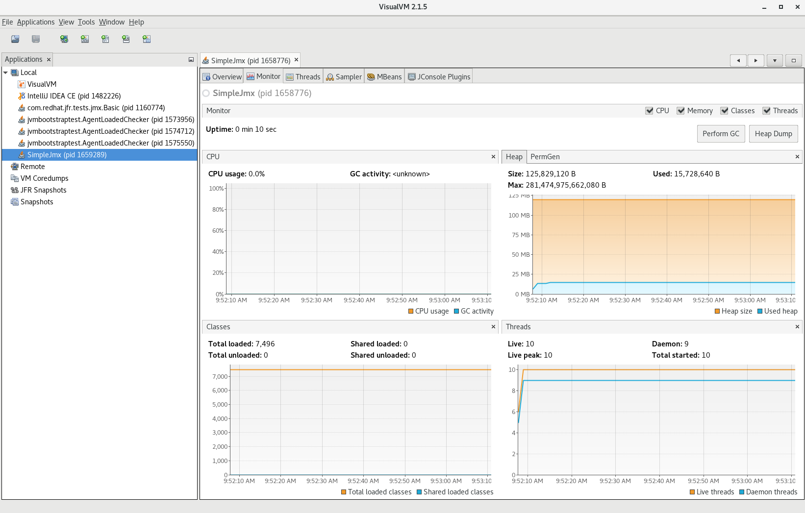
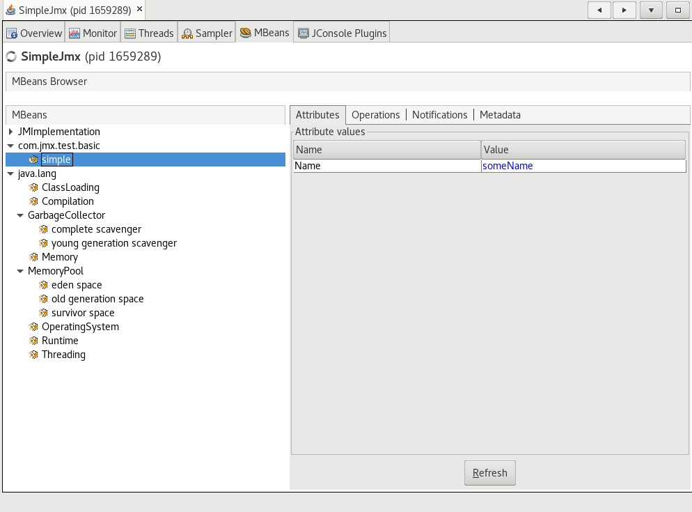
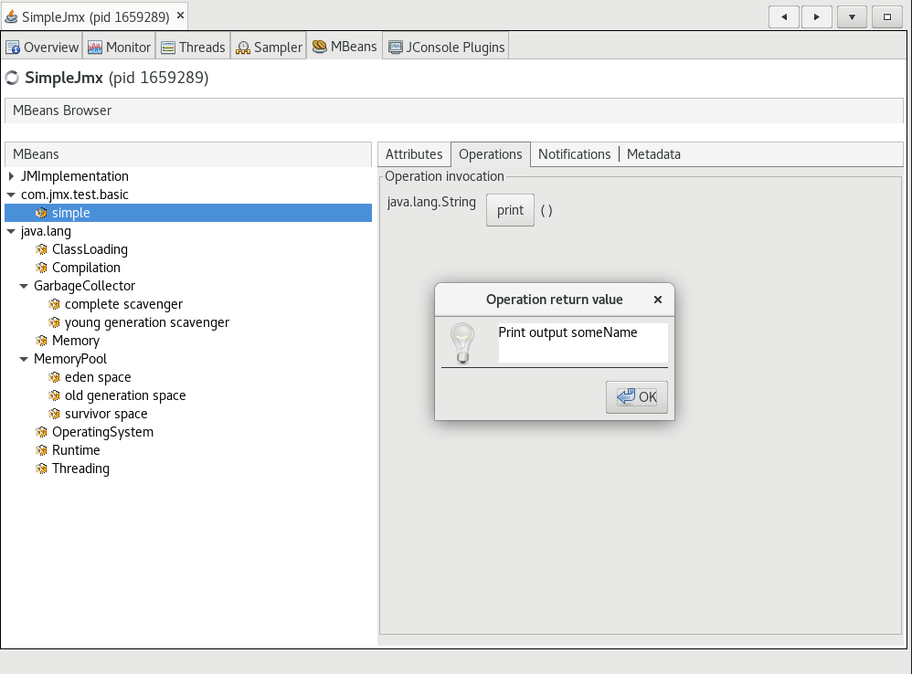

# Build and Run Native Executables with Remote JMX

Remote management using [Java Management Extensions (JMX)](https://www.oracle.com/java/technologies/javase/javamanagement.html) is possible in executables built with GraalVM Native Image. This demo shows how to build, run, and interact with such a native executable using JMX.
It also shows you how to register a custom managed bean (MBean), with the JMX server and the additional steps required for it to work with Native Image.

> Note: This demo works with GraalVM for JDK 17 and later.

## Step 1: Preparation

1. Download and install the latest GraalVM JDK with Native Image using the [GraalVM JDK Downloader](https://github.com/graalvm/graalvm-jdk-downloader):
    ```bash
    bash <(curl -sL https://get.graalvm.org/jdk)
    ```

2. Download the demos repository or clone it as follows:
    ```bash
    git clone https://github.com/graalvm/graalvm-demos
    ```
    ```bash
    cd graalvm-demos/native-image-jmx-demo
    ```
   
## Step 2: Compile to Java Bytecode

Compile the _SimpleJmx.java_ using the GraalVM JDK:

```shell 
$JAVA_HOME/bin/javac SimpleJmx.java
```
This creates `SimpleJmx.class`, `SimpleJmx$Simple.class`, and `SimpleJmx$SimpleMBean.class` files.

The `main()` method in _SimpleJmx.java_ registers a custom MBean, then loop endlessly, so you have time to inspect the process using VisualVM.

### Dynamic Proxy Configuration

JMX uses dynamic proxies to access MBeans. To be able to interact with the custom `SimpleMBean` at run time, you need to provide Native Image with additional [dynamic proxy configuration](https://www.graalvm.org/dev/reference-manual/native-image/dynamic-features/DynamicProxy/) for the MBean interface. For this, you can see a JSON file in a working directory named _proxy-config.json_ with the following contents:

```json
[
  { "interfaces": [ "SimpleJmx$SimpleMBean"] }
]
```

In the next step, you will pass this JSON file to the `native-image` builder.

## Step 3: Build a Native Executable with JMX Support

Build a native executable with VM monitoring enabled:

```shell
$JAVA_HOME/bin/native-image --enable-monitoring=jmxserver,jvmstat  -H:DynamicProxyConfigurationFiles=proxy-config.json SimpleJmx
```

The `--enable-monitoring=jmxserver` option enables the JMX Server feature which allows accepting incoming connections.
The `--enable-monitoring=jmxclient` option enables the JMX Client feature which allows making outgoing connections.
Both features can be used together, comma-separated, for example, `--enable-monitoring=jmxserver,jmxclient`. 
The `jvmstat` option should also be included if you want to enable discovery by VisualVM and other JVMs: `--enable-monitoring=jmxserver,jmxclient,jvmstat`.

## Step 4: Run the Executable with JMX Properties

Now run your native executable with JMX properties:

```shell
./simplejmx -Dcom.sun.management.jmxremote.authenticate=false -Dcom.sun.management.jmxremote.port=9996 -Dcom.sun.management.jmxremote.ssl=false
```
This starts the application as a simple JMX server, without password authentication or SSL using port `9996`. 
You can configure JMX to apply all the usual properties as shown in [this guide](https://docs.oracle.com/javadb/10.10.1.2/adminguide/radminjmxenabledisable.html), but this example uses a basic configuration for simplicity.

## Step 5: Inspect Using VisualVM

1. Start [VisualVM](https://visualvm.github.io/) to view the managed beans in a user-friendly way.
   > Note: VisualVM is shipped separately and should be first added to GraalVM using `gu`, and then started:

    ```shell
    $JAVA_HOME/bin/gu install visualvm
    ```
    ```shell
    $JAVA_HOME/bin/jvisualvm
    ```

2. Make sure you have the **VisualVM-MBeans plugin** installed (go to Tools, then Plugins, under Available Plugins, select "VisualVM-MBeans", and click Install).

3. Go to the **Applications** tab and select the **SimpleJmx** process.
   From there you can select the **MBeans** tab.

    

4. In the **MBeans** tab, you can inspect the custom MBean you created earlier and perform operations on it.

    

    

To conclude, Native Image now provides support for remote management using [JMX](https://www.oracle.com/java/technologies/javase/javamanagement.html).
Users can enable the JMX agent in a native executable to monitor a client application running on a remote system.

### Related Documentation
- [Enabling and disabling JMX](https://docs.oracle.com/javadb/10.10.1.2/adminguide/radminjmxenabledisable.html)
- [Create Heap Dumps with VisualVM](https://www.graalvm.org/dev/reference-manual/native-image/guides/create-heap-dump/)
- [Dynamic Proxy](https://www.graalvm.org/dev/reference-manual/native-image/dynamic-features/DynamicProxy/)
