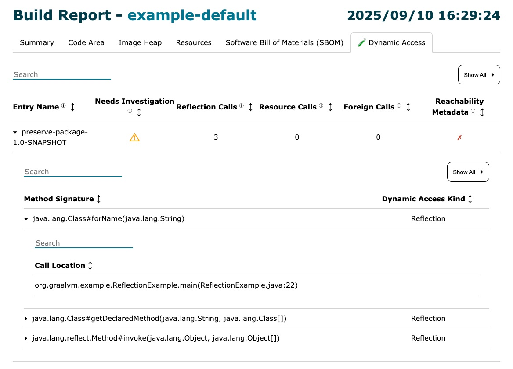

# Using Native Image `Preserve` Option

Reflection is a feature of the Java programming language that enables a running
Java program to examine and modify attributes of its classes, interfaces,
fields, and methods. GraalVM Native Image automatically supports some uses of
reflection. Native Image uses static analysis to identify what classes, methods,
and fields are needed by an application, but it may not detect some elements of
your application that are accessed using the [Java Reflection
API](https://docs.oracle.com/en/java/javase/24/docs/api/java.base/java/lang/reflect/package-summary.html).
You must declare any undetected reflection usage to the `native-image` tool,
either as metadata ([precomputed in code or as JSON configuration
files](https://www.graalvm.org/latest/reference-manual/native-image/metadata/))
or using the `-H:Preserve` option (experimental in GraalVM 25).

This guide demonstrates how to declare reflection configuration using the
`-H:Preserve` option.

## Preparation

1. Download and install the latest GraalVM 25 (or the early access build before
   2025-09-16) using [SDKMAN!](https://sdkman.io/).

    ```shell
    sdk install java 25.ea.34-graal
    ```

2. Download or clone this repository, and navigate into the
   `native-image/preserve-package` directory:

    ```shell
    git clone https://github.com/graalvm/graalvm-demos
    cd graalvm-demos/native-image/preserve-package
    ```

## Example Using Reflection on the JVM

The `ReflectionExample` class uses command line argument values to reflectively
create an instance of a class and invoke a method with a provided argument. The
core code is:

```java
    Class<?> clazz = Class.forName(className);
    Method method = clazz.getDeclaredMethod(methodName, String.class);
    Object result = method.invoke(null, input);
```

This approach works on the JVM as long as the required classes and methods are
available on the classpath.

1. Compile the application and create a JAR file using Maven:

    ```shell
    ./mvnw package
    ```

2. Run `ReflectionExample` (the JAR entry point) to invoke the `StringReverser` action:

    ```shell
    $ java -jar target/preserve-package-1.0-SNAPSHOT.jar \
       org.graalvm.example.action.StringReverser reverse "hello"
    ```

    Expected output:

    ```shell
    olleh
    ```

3. Run the same command for the `StringCapitalizer` action:

    ```shell
    $ java -jar target/preserve-package-1.0-SNAPSHOT.jar \
       org.graalvm.example.action.StringCapitalizer capitalize "hello"
    ```

    Expected output:

    ```shell
    HELLO
    ```

## GraalVM Native Image

You can compile the project with Native Image, specifying `ReflectionExample` as
the main entry point. The [_pom.xml_](pom.xml) file uses the [Native Build Tools
Maven
plugin](https://graalvm.github.io/native-build-tools/latest/maven-plugin.html)
to compile the project with the `native-image` tool.

1. Build a native executable using the `native-default` profile (see the [_pom.xml_](pom.xml) file):

    ```shell
    ./mvnw package -Pnative-default
    ```

2. Run the resulting `example-default` native executable:

    ```bash
    ./target/example-default \
       org.graalvm.example.action.StringReverser reverse "hello"
    ```

    You will see a `ClassNotFoundException` similar to:

    ```shell
    Exception in thread "main" java.lang.ClassNotFoundException: org.graalvm.example.action.StringReverser
        at org.graalvm.nativeimage.builder/com.oracle.svm.core.hub.ClassForNameSupport.forName(ClassForNameSupport.java:339)
        at org.graalvm.nativeimage.builder/com.oracle.svm.core.hub.ClassForNameSupport.forName(ClassForNameSupport.java:298)
        at java.base@25/java.lang.Class.forName(DynamicHub.java:1758)
        at java.base@25/java.lang.Class.forName(DynamicHub.java:1704)
        at java.base@25/java.lang.Class.forName(DynamicHub.java:1691)
        at org.graalvm.example.ReflectionExample.main(ReflectionExample.java:56)
        at java.base@25/java.lang.invoke.LambdaForm$DMH/sa346b79c.invokeStaticInit(LambdaForm$DMH)
    ```

This error occurs because the `native-image` tool's static analysis did not
determine that your application uses the `StringReverser` class, and did not
include it in the native executable.

## Identifying Dynamic Access

Identifying possible reflection-related failures like this--before they happen-is
easier with a new experimental GraalVM 25 feature.  By enabling the
`-H:+ReportDynamicAccess` option, a `native-image` [Build
Report](https://www.graalvm.org/latest/reference-manual/native-image/overview/build-report/)
will contain details of use of reflection found in code included in a  generated
executable.  

This examples enables the dynamic access report in of the `native-default` profile in the `pom.xml`. 

```xml
    <configuration>
        ...
        <buildArgs>
            <buildArg>-H:+UnlockExperimentalVMOptions</buildArg>
            <buildArg>-H:+ReportDynamicAccess</buildArg>
            <buildArg>--emit=build-report</buildArg>
        </buildArgs>
```

You may have noticed that the `Build artifacts` section of the `native-image`
build output listed two artifacts: the generated executable *and* an HTML build
report file.  You can find `example-default-build-report.html` in the `target`
folder alongside the `example-default` executable.

If you open the file and select the "Dynamic Access" tab you'll see that the
extensive reflective access used in `ReflectionExample::main` is flagged for
review. Using this information we can see that we need to ensure that the
classes this code tries to load are included in the generate image.



## Native Image Using `-H:Preserve`

To make it easy to ensure required classes are included in an executable,
GraalVM 25 introduced the experimental `-H:Preserve` option.

This option lets you instruct the `native-image` tool to keep entire packages,
modules, or all classes on the classpath.

In this example, both classes used via reflection are in the
`org.graalvm.example.action` package. You can use `-H:Preserve=package` to keep
all of the classes in that package in the native executable, even if static
analysis cannot discover them.

Native Image command line arguments can be specified as `<buildArgs>` in the
`native-maven-plugin` configuration. Since the `-H:Preserve` option is
experimental, you must also enable its use with
`-H:+UnlockExperimentalVMOptions`. For the complete plugin configuration, see
the `native-preserve` profile in the [_pom.xml_](pom.xml) file:

```xml
    <configuration>
        ...
        <buildArgs>
            <buildArg>-H:+UnlockExperimentalVMOptions</buildArg>
            <buildArg>-H:Preserve=package=org.graalvm.example.action</buildArg>
        </buildArgs>
    </configuration>
```

1. Build a native executable using the `native-preserve` profile, which adds
   `-H:Preserve=package=org.graalvm.example.action` when running the
   `native-image` tool:

    ```shell
    ./mvnw package -Pnative-preserve
    ```

2. Run the new `example-preserve` executable to confirm the previously missing
   `StringReverser` class and its methods are now included:

    ```shell
    ./target/example-preserve \
       org.graalvm.example.action.StringReverser reverse "hello"
    ```

    Expected output:

    ```shell
    olleh
    ```

3. Run the executable to confirm the `StringCapitalizer` class works too:

    ```shell
    ./target/example-preserve \
       org.graalvm.example.action.StringCapitalizer capitalize "hello"
    ```

    Expected output:

    ```shell
    HELLO
    ```

As demonstrated, the `-H:+ReportDynamicAccess` option can be used to identify
code that uses reflection and which may require additional configuration. A
useful companion feature, the `-H:Preserve` option provides an easy way to
ensure that Native Image includes classes not discovered by static analysis.  

### Related Documentation

* [Reachability Metadata: Reflection](https://www.graalvm.org/latest/reference-manual/native-image/metadata/)
* [Assisted Configuration with Tracing Agent](https://www.graalvm.org/latest/reference-manual/native-image/metadata/AutomaticMetadataCollection/#tracing-agent)
* [Java Reflection API](https://docs.oracle.com/en/java/javase/17/docs/api/java.base/java/lang/reflect/package-summary.html)