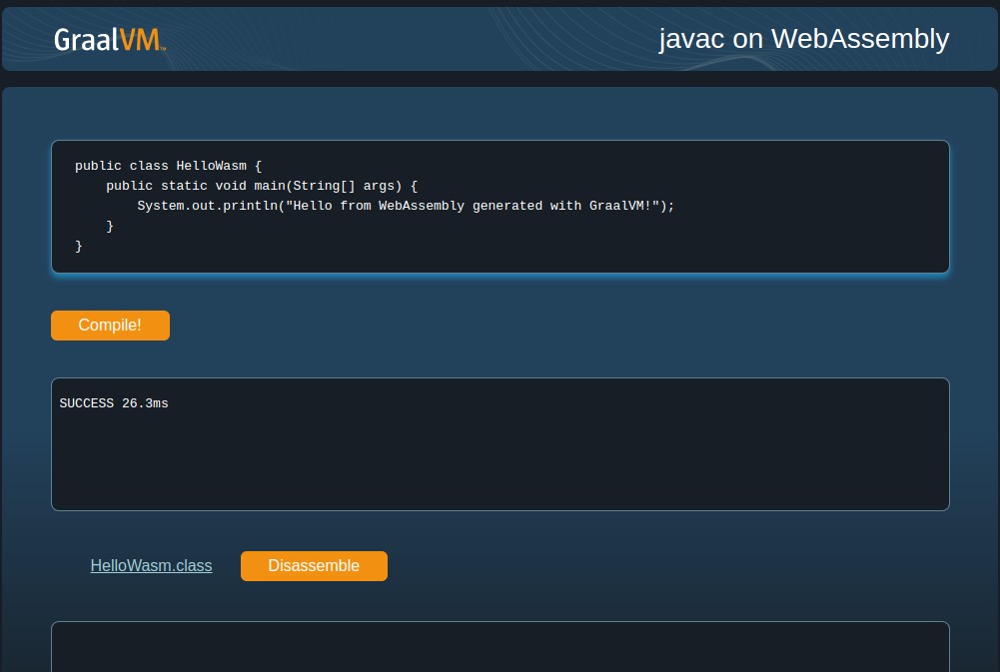

# Compile `javac` into a Wasm Module

This demo illustrates how to use the new experimental WebAssembly backend for GraalVM to compile the `javac` tool into a Wasm module that can then run on the command-line or in the browser. [Check out the live demo here](https://graalvm.github.io/graalvm-demos/native-image/wasm-javac/).

## Prerequisites

This demo requires:

1. An [Early Access Build](https://github.com/graalvm/oracle-graalvm-ea-builds) of Oracle GraalVM for JDK 25 or later.
    For example, using SDKMAN!: `sdk install java 25.ea.18-graal`
2. The [Binaryen toolchain](https://github.com/WebAssembly/binaryen) in version 119 or later and on the system path.
    For example, using Homebrew: `brew install binaryen`

## Run `javac` on Node

1. Build the Wasm module with the `native` profile:
    ```bash
    $ ./mvnw -Pnative package
    ```
    The demo uses the [Native Build Tools](https://graalvm.github.io/native-build-tools/latest/index.html) for building native images with GraalVM and Maven.
    This command generates a Wasm file and a corresponding JavaScript binding in the `target` directory.

2. Compile a Java file:
    ```bash
    node target/javac.js HelloWasm.java
    ```
    The resulting `HelloWasm.class` file is placed next to `HelloWasm.java`.
    This requires Node.js 22 or later.

## Run `javac` in the Browser

1. Build the Wasm module with the `javacweb` profile:
    ```bash
    ./mvnw -Pjavacweb package
    ```
    This command generates a Wasm file and a corresponding JavaScript binding in the `web` directory.

2. Run a local web server in the `web` directory:
    ```bash
    cd web
    jwebserver
    ```
    This will serve the `web` directory locally on port `8000`.

3. Navigate to http://localhost:8000 to compile Java programs and disassemble JVM bytecode in the browser:

